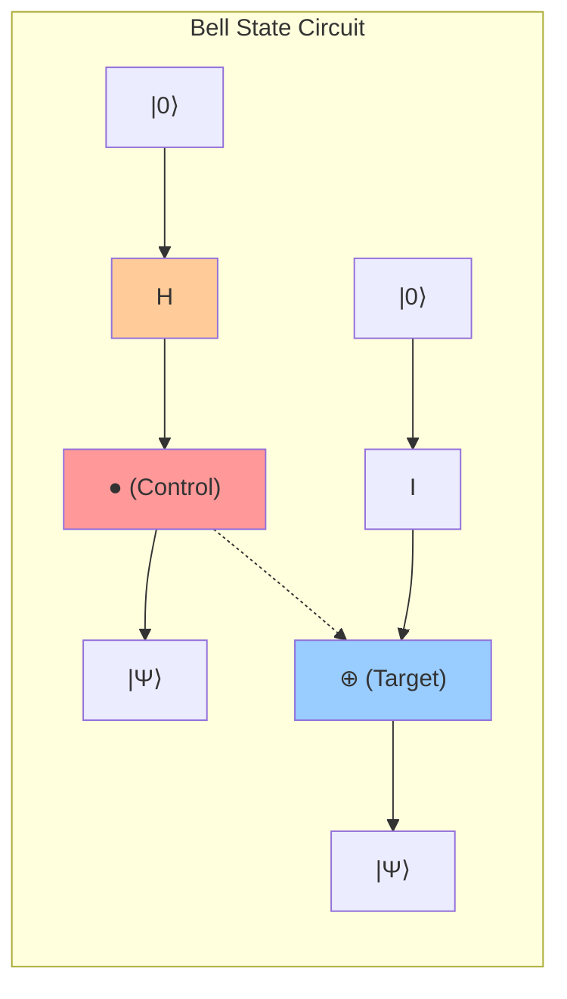
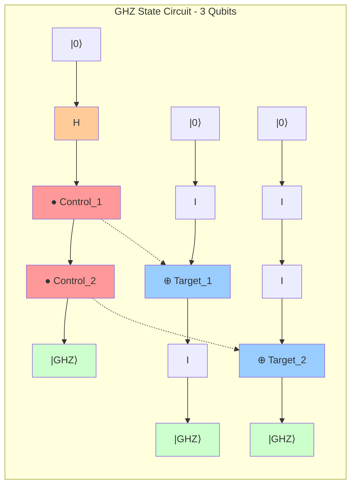
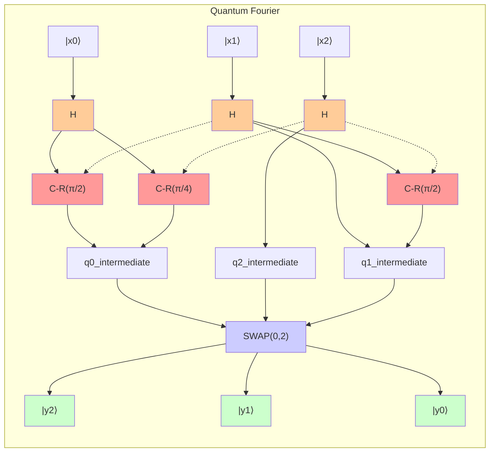
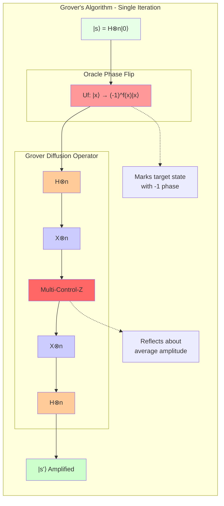
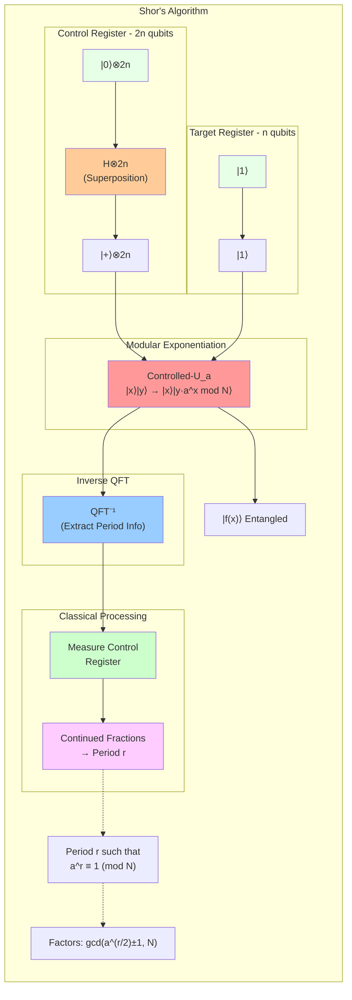

# CHAOS - A Physics-Accurate Quantum Computing Simulator

**[View on GitHub](https://github.com/0xReLogic/Chaos)**

CHAOS is a multi-qubit quantum computing simulator built in Python. It is designed from the ground up to be physically accurate, modeling quantum phenomena like superposition and entanglement through a professional, state-vector-based architecture.

## Vision & Philosophy

In Greek mythology, **Chaos** is the primordial void from which the cosmos was born. This project embodies that spirit: it provides a foundational framework to simulate the probabilistic, indeterminate nature of quantum mechanics, from which definite, classical answers emerge upon measurement.

Unlike simpler simulators that manage qubits individually, CHAOS adopts the industry-standard approach used in professional and academic research, ensuring that its behavior correctly reflects the underlying mathematics of quantum mechanics.

## Core Architectural Pillars

The simulator's accuracy and power rest on three fundamental pillars:

1.  **Global State Vector**: The entire multi-qubit system is represented by a single, unified state vector of size 2^n (where n is the number of qubits). This is the only way to correctly capture system-wide correlations and entanglement.
2.  **Tensor Product Gate Application**: Quantum gates are not applied to qubits in isolation. Instead, they are expanded into full-system operators using the tensor product (Kronecker product). For example, applying a Hadamard gate to the first of three qubits involves creating an `H ⊗ I ⊗ I` operator, which then acts on the entire state vector. This is computationally intensive but physically correct.
3.  **Probabilistic Measurement & State Collapse**: Measurement is a probabilistic process based on the amplitudes of the state vector. When a qubit is measured, the system's state vector collapses into a new, valid state consistent with the measurement outcome, accurately modeling quantum mechanics.

## Key Features

-   **Stateful, Multi-Qubit Circuits**: Create circuits with any number of qubits.
-   **Rich State Visualization**: A human-readable `print()` output for any circuit, automatically calculating and displaying:
    -   Marginal probabilities for each qubit.
    -   An entanglement status (`Entangled` or `Separable`).
    -   Full system state probabilities.
-   **Accurate Partial Measurement**: Measure a single qubit and watch the entire system state collapse correctly.
-   **Iconic State Generators**: Built-in functions to instantly create famous entangled states like the Bell State and GHZ State.
-   **Advanced Quantum Algorithms**: Fully verified implementations of the Quantum Fourier Transform (QFT) and Grover's Search Algorithm.

## Installation

```bash
# It is recommended to use a virtual environment
python -m venv venv
# Windows: venv\Scripts\activate | MacOS/Linux: source venv/bin/activate

pip install -r requirements.txt
```

## Usage Guide

### Example 1: Creating a Bell State (2-Qubit Entanglement)

The Bell State is the simplest and most famous example of entanglement.

```python
from quantum_circuit import create_bell_state

# This helper function creates a 2-qubit circuit,
# applies H to the first qubit, then CNOT(0, 1).
bell_circuit = create_bell_state()
bell_circuit.run()

print(bell_circuit)
```

**Circuit Diagram:**



**Expected Output:**
```
Quantum Circuit (2 qubits, Entangled)
=====================================
Qubit 0: |0⟩=50.0%, |1⟩=50.0%
Qubit 1: |0⟩=50.0%, |1⟩=50.0%
-------------------------------------
System State Probabilities:
  |00⟩: 50.0%
  |11⟩: 50.0%
```
This output correctly shows that the system is entangled and will only ever be measured as `00` or `11`.

### Example 2: Creating a GHZ State (Multi-Qubit Entanglement)

The Greenberger–Horne–Zeilinger (GHZ) state extends entanglement to three or more qubits.

```python
from quantum_circuit import create_ghz_state

ghz_circuit = create_ghz_state(3)
ghz_circuit.run()

print(ghz_circuit)
```

**Circuit Diagram (3 Qubits):**



**Expected Output:**
```
Quantum Circuit (3 qubits, Entangled)
=====================================
Qubit 0: |0⟩=50.0%, |1⟩=50.0%
Qubit 1: |0⟩=50.0%, |1⟩=50.0%
Qubit 2: |0⟩=50.0%, |1⟩=50.0%
-------------------------------------
System State Probabilities:
  |000⟩: 50.0%
  |111⟩: 50.0%
```
This shows that all three qubits are linked; they will all be `0` or all be `1` upon measurement.

## Advanced Algorithms

### Quantum Fourier Transform (QFT)

The QFT is a fundamental building block in many quantum algorithms, most notably Shor's algorithm for factorization. CHAOS now features a fully verified implementation of QFT and its inverse (IQFT).

Here is an example of how to create a 3-qubit circuit, prepare an initial state, apply the QFT, and then apply the IQFT to recover the initial state, proving the implementation's correctness:

```python
import numpy as np
from quantum_circuit import QuantumCircuit

# 1. Initialize a 3-qubit circuit
qc = QuantumCircuit(3)

# 2. Prepare a non-trivial initial state, e.g., |101>
qc.apply_gate('X', 0)
qc.apply_gate('X', 2)
qc.run()
initial_state = np.copy(qc.state_vector)

# 3. Apply the QFT
qc.operations = [] # Clear preparation operations
qc.apply_qft()
qc.run()

# 4. Apply the IQFT to return to the initial state
qc.operations = []
qc.apply_iqft()
qc.run()

# 5. Verify that the final state matches the initial state
assert np.allclose(initial_state, qc.state_vector)
print("\nVerification successful: IQFT(QFT(|psi>)) == |psi>")
```

**QFT Circuit Diagram (3 Qubits):**



### Grover's Search Algorithm

Grover's algorithm provides a quadratic speedup for searching an unstructured database. CHAOS now fully supports the construction of Grover circuits.

The following example demonstrates how to search for the state `|110>` in a 3-qubit space:

```python
import numpy as np
import math
from quantum_circuit import QuantumCircuit

# Define the 3-qubit system and the state to search for ('110')
num_qubits = 3
marked_state_str = '110'

# 1. Initialize circuit and create uniform superposition
qc = QuantumCircuit(num_qubits)
qc.apply_hadamard_to_all()

# 2. Determine the optimal number of iterations
N = 2**num_qubits
optimal_iterations = math.floor(math.pi / 4 * math.sqrt(N))

# 3. Apply Grover iterations
for _ in range(optimal_iterations):
    qc.apply_grover_iteration(marked_state_str)

# 4. Run the circuit and verify the result
qc.run()
probabilities = np.abs(qc.state_vector)**2
most_likely_state = np.argmax(probabilities)

print(f"Probability of finding |{marked_state_str}>: {probabilities[int(marked_state_str, 2)]:.2%}")
assert most_likely_state == int(marked_state_str, 2)
print("\nVerification successful: Grover's algorithm found the marked state.")

**Grover's Single Iteration Circuit:**



## Shor's Algorithm: Period-Finding

The crowning achievement of the CHAOS simulator is its ability to run the quantum period-finding subroutine of Shor's algorithm. This algorithm is the key to breaking modern RSA encryption and demonstrates a significant quantum advantage.

**Shor's Period-Finding Circuit:**



### Core Components

1.  **Controlled Modular Multiplier (`apply_c_modular_multiplier`)**: This is a low-level controlled gate that performs the operation `|c⟩|y⟩ → |c⟩|y * a mod N⟩` if the control qubit `c` is `|1⟩`.

2.  **Modular Exponentiation (`apply_modular_exponentiation`)**: This is the heart of the algorithm. It uses a series of controlled modular multipliers to perform the transformation `|x⟩|y⟩ → |x⟩|y * a^x mod N⟩`. It constructs this complex operation by applying the correct `a^(2^i)` multiplier for each control qubit `i` in the `x` register.

3.  **Quantum Fourier Transform (`apply_qft` and `apply_iqft`)**: The QFT is used to transform the state of the control register from the computational basis to the Fourier basis, which is where the period information resides.

### End-to-End Example: Factoring 15

The following script, `test_shor.py`, demonstrates the full quantum pipeline for finding the period of `a=7` modulo `N=15`. The expected period is `r=4`.

Because the algorithm is probabilistic, it may sometimes return a factor of the true period (like 2) or fail if the measurement is 0. However, with repeated runs, it will find the correct period with high probability.

```python
import numpy as np
from quantum_circuit import QuantumCircuit
from fractions import Fraction
import math

def run_shor_period_finding(a: int, N: int):
    """
    Runs the quantum part of Shor's algorithm to find the period 'r' of a^x mod N.
    """
    # 1. Determine the number of qubits required.
    n = math.ceil(math.log2(N))
    num_control_qubits = 2 * n
    num_ancilla_qubits = n
    total_qubits = num_control_qubits + num_ancilla_qubits

    control_qubits = list(range(num_control_qubits))
    ancilla_qubits = list(range(num_control_qubits, total_qubits))

    print(f"--- Running Shor's Period Finding for a={a}, N={N} ---")
    print(f"Control Qubits: {num_control_qubits}, Ancilla Qubits: {num_ancilla_qubits}")

    # 2. Create the quantum circuit.
    qc = QuantumCircuit(total_qubits)

    # 3. Initialize the state.
    # Apply Hadamard to control qubits to create superposition.
    for i in control_qubits:
        qc.apply_gate('H', i)

    # Set ancilla register to |1>.
    qc.apply_gate('X', ancilla_qubits[-1])

    # 4. Apply the modular exponentiation.
    qc.apply_modular_exponentiation(a, N, control_qubits, ancilla_qubits)

    # 5. Apply the Inverse QFT on the control register.
    qc.apply_iqft(control_qubits, swaps=True)

    # 6. Run the simulation.
    qc.run()

    # 7. Measure the control qubits.
    measurement_results = qc.measure(control_qubits)
    measurement_int = int("".join(map(str, measurement_results)), 2)
    
    print(f"Measurement result (integer): {measurement_int}")

    # 8. Classical post-processing to find the period 'r'.
    if measurement_int == 0:
        print("Measurement is 0, cannot determine period. Please run again.")
        return

    phase = measurement_int / (2**num_control_qubits)
    print(f"Phase = {phase:.4f}")

    # Use continued fractions to find the period r.
    frac = Fraction(phase).limit_denominator(N)
    r = frac.denominator
    print(f"Deduced period r = {r}")

    # 9. Validate the period.
    if pow(a, r, N) == 1:
        print(f"SUCCESS: {a}^{r} mod {N} = 1. Period found is correct.")
    else:
        print(f"FAILURE: {a}^{r} mod {N} != 1. Period found is incorrect.")

if __name__ == "__main__":
    N = 15
    a = 7 # The period of 7^x mod 15 is 4.
    run_shor_period_finding(a, N)

```

### Running the Test

A successful run will produce the following output:

```
--- Running Shor's Period Finding for a=7, N=15 ---
Control Qubits: 8, Ancilla Qubits: 4
Running circuit...
Circuit run complete.
Measurement result (integer): 64
Phase = 0.2500
Continued fraction approximation: 1/4
Deduced period r = 4
SUCCESS: 7^4 mod 15 = 1. Period found is correct.
```

## Future Roadmap

CHAOS is feature-complete for its initial goals, but there is always room for growth. Future development will focus on two key areas:

### Phase 7: Performance & Advanced Simulation
- **Mission**: Enhance the simulator's speed and realism to handle larger circuits.
- **Goals**: Profile and optimize core operations, explore GPU acceleration (e.g., with `cupy`), and implement basic noise models for more realistic simulations.

### Phase 8: Usability & Integration
- **Mission**: Make CHAOS more accessible and integrable with the wider quantum ecosystem.
- **Goals**: Develop a more abstract API for circuit building, improve circuit visualization, and design a bridge to convert circuits from/to standard formats like Qiskit or Cirq.

---

<p align="center">
  Made with ❤️ 0xReLogic
</p>
